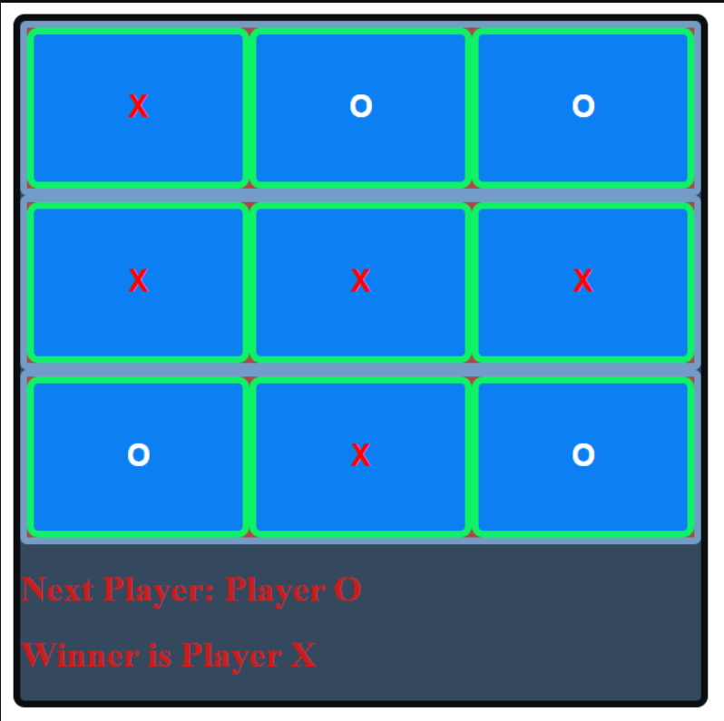

# tiktacgame

## Description of Project
In this exercise, a Tic-Tac-Toe game was create to implement and practice using parent and child functions/relationships for JSX. A React App was created to interact and play the classic game.

## How To Run
Open a browser window and load the index.html file.
The gameboard should appear on the screen.
Begin clicking on the board to play.

## Roadmap for Updates
For an updated feature, I would like to allow a "computer" to play against the individual. If you don't have a second player, then you can play against the program. In order to implement this, you would need to create a secondary player that would have a randomized selection for its turns. 
A second update that I would like to implement is a reset/"It's a Draw!" feature. If the game ends in a draw, you would be given the option to reset the game board and start a new game.

## License Information
LICENSE: MIT License

Copyright (c) 2022 Sabrina Russell

Permission is hereby granted, free of charge, to any person obtaining a copy
of this software and associated documentation files (the "Software"), to deal
in the Software without restriction, including without limitation the rights
to use, copy, modify, merge, publish, distribute, sublicense, and/or sell
copies of the Software, and to permit persons to whom the Software is
furnished to do so, subject to the following conditions:

The above copyright notice and this permission notice shall be included in all
copies or substantial portions of the Software.

THE SOFTWARE IS PROVIDED "AS IS", WITHOUT WARRANTY OF ANY KIND, EXPRESS OR
IMPLIED, INCLUDING BUT NOT LIMITED TO THE WARRANTIES OF MERCHANTABILITY,
FITNESS FOR A PARTICULAR PURPOSE AND NONINFRINGEMENT. IN NO EVENT SHALL THE
AUTHORS OR COPYRIGHT HOLDERS BE LIABLE FOR ANY CLAIM, DAMAGES OR OTHER
LIABILITY, WHETHER IN AN ACTION OF CONTRACT, TORT OR OTHERWISE, ARISING FROM,
OUT OF OR IN CONNECTION WITH THE SOFTWARE OR THE USE OR OTHER DEALINGS IN THE
SOFTWARE.
